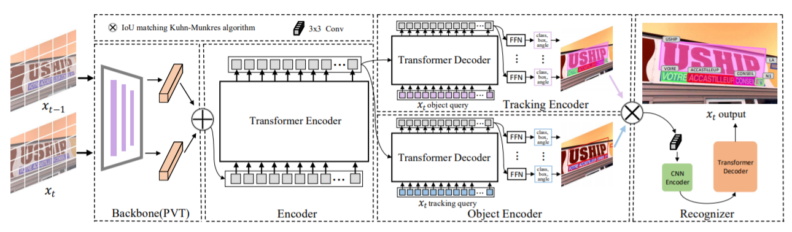

## TransVTSpotter: End-to-end Video Text Spotter with Transformer

[](https://opensource.org/licenses/MIT)




## Introduction
[A Multilingual, Open World Video Text Dataset and End-to-end Video Text Spotter with Transformer](https://arxiv.org/pdf/2112.04888.pdf)

Link to our [MOVText: A Large-Scale, Multilingual Open World Dataset for Video Text Spotting](https://github.com/weijiawu/MOVText-Benchmark)


## Updates
- (08/04/2021) Refactoring the code.  

- (10/20/2021) The complete code has been released . 

## [ICDAR2015(video) Tracking challenge](https://rrc.cvc.uab.es/?ch=3&com=evaluation&task=1)

Methods | MOTA | MOTP | IDF1 | Mostly Matched |	Partially Matched |	Mostly Lost
:---:|:---:|:---:|:---:|:---:|:---:|:---:
TransVTSpotter | 45.75	|73.58	|57.56	|658	|611	|647


#### Notes
- The training time is on 8 NVIDIA V100 GPUs with batchsize 16.
- We use the models pre-trained on COCOTextV2.
- We do not release the recognition code due to the company's regulations.


## Demo
  


## Installation
The codebases are built on top of [Deformable DETR](https://github.com/fundamentalvision/Deformable-DETR) and [TransTrack](https://github.com/PeizeSun/TransTrack).

#### Requirements
- Linux, CUDA>=9.2, GCC>=5.4
- Python>=3.7
- PyTorch ≥ 1.5 and [torchvision](https://github.com/pytorch/vision/) that matches the PyTorch installation.
  You can install them together at [pytorch.org](https://pytorch.org) to make sure of this
- OpenCV is optional and needed by demo and visualization


#### Steps
1. Install and build libs
```
git clone git@github.com:weijiawu/TransVTSpotter.git
cd TransVTSpotter
cd models/ops
python setup.py build install
cd ../..
pip install -r requirements.txt
```

2. Prepare datasets and annotations

COCOTextV2 dataset is available in [COCOTextV2](https://bgshih.github.io/cocotext/). 
```
python3 track_tools/convert_COCOText_to_coco.py
```
ICDAR2015 dataset is available in [icdar2015](https://rrc.cvc.uab.es/?ch=3&com=downloads).
```
python3 track_tools/convert_ICDAR15video_to_coco.py
```

3. Pre-train on COCOTextV2
```
python3 -m torch.distributed.launch --nproc_per_node=8 --use_env main_track.py  --output_dir ./output/Pretrain_COCOTextV2 --dataset_file pretrain --coco_path ./Data/COCOTextV2 --batch_size 2  --with_box_refine --num_queries 500 --epochs 300 --lr_drop 100 --resume ./output/Pretrain_COCOTextV2/checkpoint.pth

python3 track_tools/Pretrain_model_to_mot.py
```
The pre-trained model is available [Baidu Netdisk](https://pan.baidu.com/s/1E_srg-Qm8yMgmh6AVlw0Tg)， password:59w8.
[Google Netdisk](https://drive.google.com/file/d/1CPqE9D46vlOeO41sWIEXBjAnlbe5hSmG/view?usp=sharing)

And the MOTA 44% can be found [here](https://pan.baidu.com/s/1u3u_P775ReuafRZ4V2amDg) password:xnlw.
[Google Netdisk](https://drive.google.com/file/d/1HO59jwzL33NYtHlhzKqwq7fYYuf9xCzH/view)

4. Train TransVTSpotter
```
python3 -m torch.distributed.launch --nproc_per_node=8 --use_env main_track.py  --output_dir ./output/ICDAR15 --dataset_file text --coco_path ./Data/ICDAR2015_video --batch_size 2  --with_box_refine  --num_queries 300 --epochs 80 --lr_drop 40 --resume ./output/Pretrain_COCOTextV2/pretrain_coco.pth
```


5. Visualize TransVTSpotter
```
python3 track_tools/Evaluation_ICDAR15_video/vis_tracking.py
```

## License

TransVTSpotter is released under MIT License.


## Citing

If you use TranVTSpotter in your research or wish to refer to the baseline results published here, please use the following BibTeX entries:
```
@article{wu2021opentext,
  title={A Bilingual, OpenWorld Video Text Dataset and End-to-end Video Text Spotter with Transformer},
  author={Weijia Wu, Debing Zhang, Yuanqiang Cai, Sibo Wang, Jiahong Li, Zhuang Li, Yejun Tang, Hong Zhou},
  journal={35th Conference on Neural Information Processing Systems (NeurIPS 2021) Track on Datasets and Benchmarks},
  year={2021}
}
```

